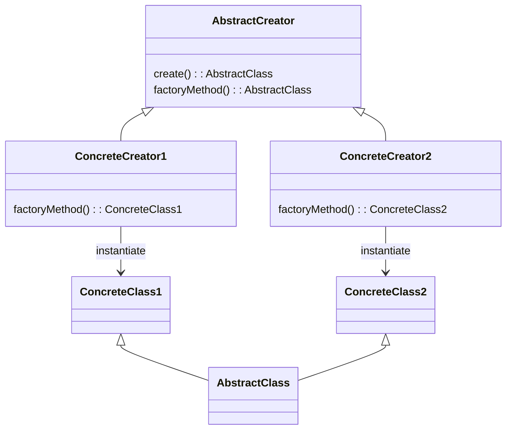

# Software Design and Architecture Week04 Worksheet

There are multiple activities each week, and you will probably not get everything done in the timetabled lab sessions; therefore, it is highly recommended that you complete the labs in your own time each week to avoid falling behind.

Completing the labs will get you ready for writing the assignment code.

**Advanced** Labs are optional, but completing the Advanced Labs will introduce you to more advanced techniques and improve your design skills.

## Hint: Starting a new Project

IntelliJ has a quick and simple way of creating a new Java project that we can use for many of the labs.

Intelli-J File menu -\> New \> Project…

Provide a project name, chose a location and ensure that you have ticked the **Add sample code** box.


# Create Singletons representing Colors

In the game application we have a concept of a Color. The colors we need are fixed and immutable, so they make good candidates for Singletons so we do not want to create new instance every time we play a game.

The code below is a simple Color ValueObject.

Use Intelli-J File menu -\> New \> Project… to create a new sample project and then write public final static Singletons representing Red, Blue, Green and Yellow colors.

```java
public class Color {
    private final String name;
    private final String escapeSequence;

    public Color(String name, String escapeSequence) {
        this.name = Objects.requireNonNull(name, "Color name cannot be null");
        this.escapeSequence = Objects.requireNonNull(escapeSequence, "Color escape sequence cannot be null");
    }

    public String getName() {
        return name;
    }

    public String getEscapeSequence() {
        return escapeSequence;
    }

    @Override
    public boolean equals(Object o) {
        if (!(o instanceof Color otherColor)) return false;
        if (this == otherColor) return true;
        return escapeSequence.equals(otherColor.escapeSequence) && name.equalsIgnoreCase(otherColor.name);
    }

    @Override
    public int hashCode() {
        return Objects.hashCode(name);
    }

    @Override
    public String toString() {
        return String.format("%s%s\u001B[0m", escapeSequence, name);
    }
}
```
This a Value Object so you need to implement the `equals()`, `hashCode()` and `toString()` methods.

The escapeSequence value is used to print colored text to the console. An escape sequence is a special text pattern which when printed by the terminal to control formatting or behavior (like colors, bold text, cursor movement, and screen clearing). The toString() override uses the escapeSequence to print the color name in the correct color. The `\u001B[0m` sequence is used to reset the color.

The escape sequences you require are

| Color  | Unicode Escape  Sequence |
|--------|--------------------------|
| red    | `\u001B[31m`             |
| blue   | `\u001B[34m`             |
| green  | `\u001B[32m`             |
| yellow | `\u001B[33m`             |


# Create Singleton Game Boards

Another example of a Value Object is a `Position` class which represents a position on the game board.

```Java
public class Position {

    private final int index;
    private final String displayName;

    public Position(int index, String displayName) {
        if((this.index = index) < 0){
            throw new IllegalArgumentException("index must be greater than or equal to 0");
        }
        this.displayName = Objects.requireNonNull(displayName, "Display name cannot be null");

    }

    public int getIndex() {
        return index;
    }
    public String getDisplayName() {
        return displayName;
    }

    @Override
    public boolean equals(Object o) {
        if (!(o instanceof Position otherPosition)) return false;
        if (this == otherPosition) return true;
        return (index == otherPosition.index) && displayName.equalsIgnoreCase(otherPosition.displayName);
    }

    @Override
    public int hashCode() {
        return Objects.hash(index, displayName);
    }
}

```

This Value Object has multiple fields, so you need to decide which ones to include in these method implementations.

Hint. To compute a hashCode for multiple fields use

`Objects.hash(Object... values)`

This method is very useful for implementing Object. hashCode() on objects containing multiple fields.

Like the Color class, the Position class is immutable, and we do not want to keep creating new instances of the same Position.
We can also create two Singleton Board classes which provides with a Singleton array of Singletons for each of the two board sizes.

```Java
public abstract class Board {
    public abstract Position[] getPositions();
    public abstract String getName();
    @Override
    public String toString() {
        return getName();
    }
}

public class SmallBoard extends Board {

    public static final Board INSTANCE = new SmallBoard();

    private static final String SIZE = "SmallBoard";

    private static final Position[] positions = new Position[]{
            new Position(0, "01"),
            new Position(1, "02"),
            new Position(2, "03"),
            ...
            new Position(23, "24"),
            new Position(24, "25")
    };

    @Override
    public Position[] getPositions() {
        return positions;
    }

    @Override
    public String getName() {
        return SIZE;
    }
}

public class LargeBoard extends Board {

    public static final Board INSTANCE = new LargeBoard();

    private static final String SIZE = "LargeBoard";
    private static final Position[] positions = new Position[]{
            new Position(0, "01"),
            new Position(1, "02"),
            new Position(2, "03"),
            ...
            new Position(34, "35"),
            new Position(35, "36")
    };

    @Override
    public Position[] getPositions() {
        return positions;
    }

    @Override
    public String getName() {
        return SIZE;
    }
}
```


**Question**: Why is it important that any Singletons are final and immutable?

## Hints and Tips

See the lecture notes and module textbook for a discussion of patterns for creating objects.

Singletons are intended to be single primitive value or single immutable object instance within a program.

In Java static fields can be used to hold constant primitive values or a single instance of an immutable class. If the value is constant, we use the CONSTANT_NAME naming convention.

# Write a Game Factory using the Abstract Factory pattern.

In the game we need to create either a SmallBoard with 2 players, or a LargeBoard with 4 players. This is a good application for the **Abstract Factory** pattern to create the matching board and players.

Firstly we need to write a Player class. We will need new instances of Player for each game, as these are stateful, mutable objects (they hold the current position of the player).

```Java
public class Player {
    private final Color color;
    private Position position;

    Player( Color color) {
        this.color = Objects.requireNonNull(color);
    }

    public Color getColor() {
        return color;
    }

    public void setPosition(Position position) {
        this.position = Objects.requireNonNull(position);
    }

    public Position getPosition() {
        return position;
    }
}
```
However, we do not want to create new instances of Color for each player, so when creating new instances of Player, you should use the Color Singletons we created earlier.

The lab task is to implement an Abstract Factory interface called GameFactory with two methods, `createBoard()` and `createPlayers()`, where `createBoard()` method should return a Board and the `createPlayers()` method should return the correct sized array of Player objects for the board size.

The two concrete implementations of the GameFactory interface should be called `SmallGameFactory` and `LargeGameFactory`, which create a SmallBoard with 2 players (Red, Blue) and a LargeBoard with 4 players  (Red, Blue, Green, Yellow) respectively.

```java
public interface AbstractGameFactory {
    Board createBoard();
    Player[] createPlayers();
}
```

Your implementation should use as many Singletons as possible, so that no matter how many games are created, we create the minimum number of new objects. Depending on the concrete GameFactory implementation the factory should provide the correct board and players.

# Write a Game Factory using the Factory Method pattern

Another common creation pattern is the **Factory Method** pattern. The Factory Method creates objects in a superclass but allows subclasses to alter the type of objects that will be created. It is slightly more complex than the Abstract Factory pattern, but a bit more flexible because it can run code before and after the concrete class is created.

Read the **Factory Method Pattern** section in the module textbook and re-implement the GameFactory example using the Factory method pattern.

Having implemented Game factories using both the Abstract Factory and Factory Method patterns, which do you prefer and why would you use one over the other?


## Hints and Tips

The general form of the **Factory Method** pattern.

Assume we want to make different concrete classes inherited from an abstract superclass

```java
abstract class AbstractClass {
    public abstract void operation();
}
class ConcreteClass1 extends AbstractClass {
    @Override
    public void operation() {
    }
}
class ConcreteClass2 extends AbstractClass {
    @Override
    public void operation() {
    }
}
```

We make an AbstractCreator which has a `public create()` method and an `abstract protected factoryMethod()`.

Concrete subclasses of the AbstractCreator implement `factoryMethod()` to create concrete classes.

The public `create()` method can contain any common code (if any) that runs before or after the requested object is made and before it is returned to the client.

```java
abstract class AbstractCreator {
    public AbstractClass create()
    {
        return factoryMethod();
    }
    protected abstract AbstractClass factoryMethod();
}
class ConcreteCreator1 extends AbstractCreator {

    @Override
    protected ConcreteClass1 factoryMethod() {
        return new ConcreteClass1();
    }
}
class ConcreteCreator2 extends AbstractCreator {
    @Override
    protected ConcreteClass1 factoryMethod() {
        return new ConcreteClass1();
    }
}

```

As a UML diagram.



**Question**: What are the differences between the Abstract Factory and Factory Method patterns. When would you use one over the other?


# Using the Abstract Factory Pattern to create different Iterators (Advanced)

We previously introduced the Java Iterable and Iterator Interfaces as a standard way of providing an iterator for a collection. The Iterable interface has a single method `iterator()` that returns an Iterator, and the Iterator interface has methods `hasNext()` and `next()` to access the elements of the collection sequentially without exposing its underlying representation.

If we want to provide different iterators for the same collection, we can use the Abstract Factory pattern to create different iterators. We need to use a Factory because the definition of the Iterable<T> interface is that it creates and returns a new instance of Iterator<T> when the `iterator()` method is called.

Now the concrete implementation of the Factory is the thing that provides the different iterators, and the client code just uses the Iterable interface to get an iterator, without needing to know which concrete implementation of the Factory is being used.

For example, in the Game we might want to provide different iterators over a collection of Players. In this case the iterator is selecting the next player to take their turn, so we might want to have a different iterator for different gamefactorymethod modes. For example, in a "normal" gamefactorymethod mode we might want to iterate over the players in the order they were added to the gamefactorymethod, but in a "random" gamefactorymethod mode we might want to iterate over the players in a random order. In our implementation of iterators the sequence never stops, the next() method keeps providing players in order.

Start with a simple `Player` class.

```java
class Player {
    private final String color;
    private final String name;

    Player(String name, String color) {
        Objects.requireNonNull(name);
        Objects.requireNonNull(color);
        this.name = name;
        this.color = color;
    }

    public String getColor() {
        return color;
    }

    public String getName() {
        return name;
    }
}
```

Create a single class called `PlayerIterable` class that implements `Iterable<Player>`.

It has a single method that returns an abstract interface, `Iterator<Player>`. You will need to create a new iterator every time the `iterator()` method is called because the state of the iterator (the current position in the collection) is maintained in each iterator instance, so we can't reuse the same iterator instance for multiple iterations.

You will therefore need use the Abstract Factory to supply a factory that creates different concrete implementations of an iterator that iterates accross an array of Players.

We suggest that you implement different iterators and factories for **forward** (players take turns in the order they were added to the gamefactorymethod), **reverse** (players take turns in the reverse order they were added to the gamefactorymethod) and **random** (players take turns in a random order) play.
